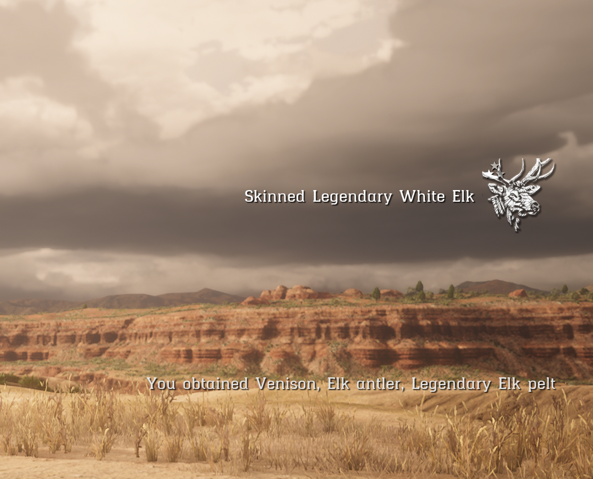

vorp_hunting with more that 150 skinable animals 
no items needed to add on database 
Replace the Config.lua in vorp_hunting 




## Requirements
- [VORP-Core](https://github.com/VORPCORE/VORP-Core/releases)
- [VORP-Inputs](https://github.com/VORPCORE/VORP-Inputs/releases)
- [VORP-Character](https://github.com/VORPCORE/VORP-Character/releases)
- [VORP-Inventory](https://github.com/VORPCORE/VORP-Inventory/releases)

## How to install
* [Download VORP Hunting](https://github.com/VORPCORE/VORP-Hunting)
* Copy and paste ```vorp_hunting``` folder to ```resources/vorp_hunting```
* Add ```ensure vorp_hunting``` to your ```server.cfg``` file
* To change the language go to ```resources/vorp_hunting/config.lua```
* Now you are ready!

Credits to [VORP] (https://github.com/VORPCORE)

##Easy Way to add more Animal Skinning
-EasySkinnableAnimalsEdit [Spreadsheet] (https://docs.google.com/spreadsheets/d/1d9VQXdl8JS76N6OFf541MN1R0XMHI2f9PHPLiJapru8/edit?usp=sharing)
